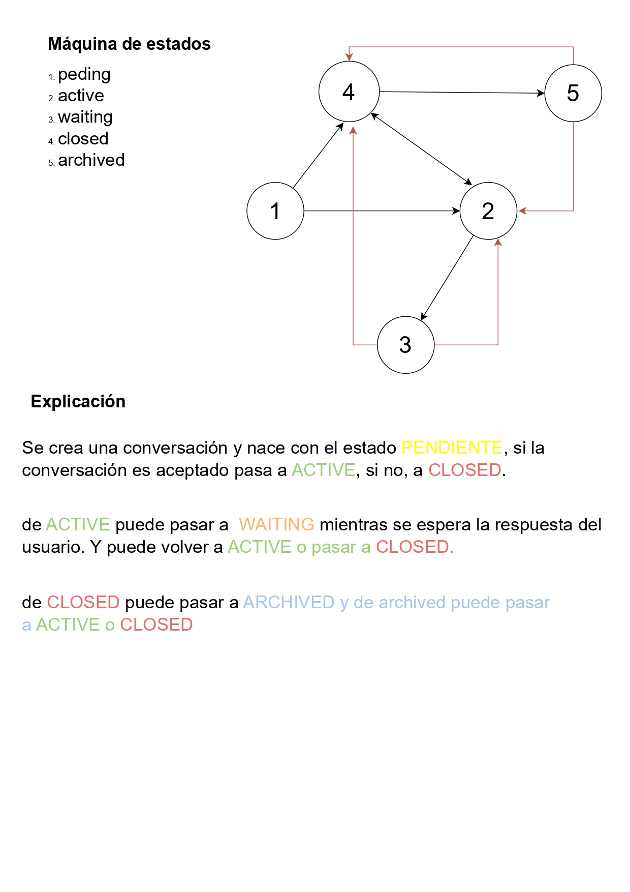

# AnonChat - Sistema de Chat Anónimo para Recursos Humanos

## 📋 Descripción

**AnonChat** es una plataforma elegante y segura diseñada específicamente para departamentos de Recursos Humanos, permitiendo que los empleados expresen sus inquietudes, sugerencias y quejas de manera completamente anónima y protegida. 

Este sistema ofrece un espacio confidencial donde los trabajadores pueden comunicarse con el equipo de RRHH sin temor a represalias, fomentando un ambiente de transparencia y confianza dentro de la organización. La plataforma garantiza la privacidad mediante un sistema robusto de autenticación basado en códigos únicos y contraseñas, asegurando que solo los participantes autorizados puedan acceder a cada conversación.

## ✨ Funcionalidad

### Estado Actual del Proyecto

Actualmente, **AnonChat** se encuentra en fase de desarrollo inicial. La funcionalidad de **login y autenticación** ha sido completamente implementada y está operativa. Los usuarios pueden:

- **Crear nuevas conversaciones**: Establecer un espacio de diálogo protegido mediante una descripción breve y una contraseña segura
- **Continuar conversaciones existentes**: Acceder a conversaciones previas utilizando un código único y su contraseña correspondiente
- **Verificación de códigos**: Validar la existencia y estado de una conversación antes de intentar acceder

### Funcionalidades Futuras

El sistema está diseñado para expandirse con las siguientes características:

#### 🗨️ Sistema de Chat
- Interfaz de mensajería en tiempo real entre empleados y administradores
- Envío de mensajes de texto
- Soporte para archivos adjuntos
- Historial completo de conversaciones

#### 👨‍💼 Panel de Administración
- **Dashboard administrativo** para el equipo de RRHH
- Visualización de todas las conversaciones activas
- Gestión centralizada de múltiples chats simultáneos
- Sistema de asignación de conversaciones a administradores específicos
- Filtros y búsqueda avanzada por estado, fecha o contenido
- Estadísticas y métricas de uso del sistema

#### 🔐 Características de Seguridad
- Autenticación robusta mediante códigos únicos generados de forma segura
- Encriptación de contraseñas utilizando algoritmos modernos
- Protección CSRF en todas las operaciones sensibles
- Headers de seguridad configurados para prevenir ataques comunes
- Sesiones seguras con configuración HTTP-only y SameSite

## 🗄️ Estructura de la Base de Datos

La base de datos `anonchatTest` está diseñada con una arquitectura relacional que garantiza la integridad de los datos y facilita futuras expansiones. La estructura actual incluye:

### Tabla `Conversation`
Almacena la información principal de cada conversación anónima:

| Campo | Tipo | Descripción |
|-------|------|-------------|
| **ID** | BIGINT PRIMARY KEY AUTO_INCREMENT | Identificador único autoincremental |
| **Code** | VARCHAR(50) UNIQUE NOT NULL | Código único alfanumérico que identifica la conversación |
| **Password_Hash** | VARCHAR(255) NULL | Hash de la contraseña de acceso |
| **Created_At** | DATETIME NOT NULL DEFAULT CURRENT_TIMESTAMP | Fecha y hora de creación |
| **Updated_At** | DATETIME NOT NULL DEFAULT CURRENT_TIMESTAMP ON UPDATE CURRENT_TIMESTAMP | Fecha y hora de última actualización |
| **Status** | ENUM('pending','active','closed','waiting','archived') NOT NULL DEFAULT 'pending' | Estado de la conversación |
| **Title** | VARCHAR(255) NULL | Título opcional de la conversación |
| **Description** | TEXT NULL | Descripción o contexto de la conversación |

### Tabla `Admin`
Gestiona las cuentas de administradores del sistema:

| Campo | Tipo | Descripción |
|-------|------|-------------|
| **ID** | BIGINT PRIMARY KEY AUTO_INCREMENT | Identificador único autoincremental |
| **User** | VARCHAR(100) UNIQUE NOT NULL | Nombre de usuario único |
| **Password_Hash** | VARCHAR(255) NOT NULL | Hash de la contraseña del administrador |

### Tabla `Messages`
Almacena todos los mensajes intercambiados en las conversaciones:

| Campo | Tipo | Descripción |
|-------|------|-------------|
| **ID** | BIGINT PRIMARY KEY AUTO_INCREMENT | Identificador único autoincremental |
| **Conversation_ID** | BIGINT NOT NULL | Referencia a la conversación (FOREIGN KEY) |
| **Sender** | ENUM('admin','user','anonymous') NOT NULL DEFAULT 'anonymous' | Tipo de remitente |
| **Content** | TEXT NULL | Contenido del mensaje |
| **File_Path** | VARCHAR(255) NULL | Ruta opcional a archivos adjuntos |
| **Created_At** | DATETIME NOT NULL DEFAULT CURRENT_TIMESTAMP | Fecha y hora de creación del mensaje |

### Índices Optimizados

Para garantizar un rendimiento óptimo, se han creado índices en:

| Índice | Tabla | Campo | Propósito |
|--------|-------|-------|-----------|
| `idx_conversation_status` | Conversation | Status | Búsquedas rápidas por estado |
| `idx_messages_conversation` | Messages | Conversation_ID | Recuperación eficiente de mensajes |
| `idx_messages_created_at` | Messages | Created_At | Ordenamiento temporal |


## 🔌 API REST y Endpoints

**AnonChat** utiliza una arquitectura RESTful que permite una comunicación eficiente y estandarizada entre el frontend y el backend. Todos los endpoints devuelven respuestas en formato JSON y están protegidos con medidas de seguridad adecuadas.

### Endpoints Disponibles

#### 1. `POST /api/api.php?action=create_conversation`
Crea una nueva conversación anónima.

**Parámetros (POST):**
- `description` (string, requerido): Descripción breve de la conversación (máx. 500 caracteres)
- `password` (string, requerido): Contraseña de acceso (mínimo 8 caracteres)
- `password_confirm` (string, requerido): Confirmación de la contraseña
- `csrf_token` (string, requerido): Token CSRF para protección

**Respuesta exitosa (201):**
```json
{
  "success": true,
  "data": {
    "message": "Conversación creada",
    "code": "ABC123XYZ456"
  }
}
```

**Errores posibles:**
- `422`: Campos faltantes, descripción demasiado larga, contraseñas no coinciden, contraseña muy corta
- `405`: Método HTTP incorrecto

#### 2. `GET /api/api.php?action=check_code&code={CODE}`
Verifica la existencia y estado de una conversación mediante su código.

**Parámetros (GET):**
- `code` (string, requerido): Código de la conversación a verificar

**Respuesta exitosa (200):**
```json
{
  "success": true,
  "data": {
    "exists": true,
    "status": "active"
  }
}
```

**Errores posibles:**
- `404`: Código no válido o no disponible
- `422`: Código no proporcionado
- `405`: Método HTTP incorrecto

#### 3. `POST /api/api.php?action=continue_conversation`
Autentica y permite el acceso a una conversación existente.

**Parámetros (POST):**
- `code` (string, requerido): Código de la conversación
- `password` (string, requerido): Contraseña de acceso
- `csrf_token` (string, requerido): Token CSRF

**Respuesta exitosa (200):**
```json
{
  "success": true,
  "data": {
    "message": "Acceso concedido",
    "conversation_id": 1,
    "code": "ABC123XYZ456"
  }
}
```

**Errores posibles:**
- `401`: Credenciales inválidas
- `422`: Código o contraseña faltantes
- `405`: Método HTTP incorrecto

#### 4. `POST /api/api.php?action=get_messages`
Obtiene todos los mensajes de una conversación autenticada.

**Parámetros (POST):**
- `code` (string, requerido): Código de la conversación
- `password` (string, requerido): Contraseña de acceso

**Respuesta exitosa (200):**
```json
{
  "success": true,
  "data": {
    "messages": [
      {
        "ID": 1,
        "Sender": "user",
        "Content": "Hola, necesito ayuda",
        "File_Path": null,
        "Created_At": "2024-01-15 10:30:00"
      }
    ]
  }
}
```

**Errores posibles:**
- `401`: Credenciales inválidas
- `422`: Código o contraseña faltantes
- `405`: Método HTTP incorrecto

### Características de Seguridad de la API

- **Validación de métodos HTTP**: Cada endpoint valida que se use el método correcto
- **Protección CSRF**: Los endpoints que modifican datos requieren token CSRF
- **Encriptación de contraseñas**: Utiliza `password_hash()` con algoritmo por defecto de PHP
- **Rehash automático**: Actualiza hashes obsoletos automáticamente
- **Headers de seguridad**: Configuración completa de CSP, X-Frame-Options, etc.
- **Prevención de enumeración**: Mensajes de error genéricos para evitar información sobre códigos válidos

## 🖼️ Capturas de Pantalla

### Interfaz Principal


### Flujo de Creación de Conversación


### Máquina de Estados

## 📁 Estructura del Proyecto

El proyecto está organizado de la siguiente manera para su publicación en GitHub:

```
complaint/
├── docs/
│   ├── ciclo.pdf
│   ├── maquinaEstados.pdf
│   ├── proyectov1.pdf
│   └── img/
├── scripts/
│   ├── DB/
│   │   ├── create_DB.sql
│   │   ├── seed.sql
│   │   ├── cleanup.sql
│   │   ├── drop.sql
│   │   └── view.sql
│   └── install.sh
├── anonchat/
│   ├── api/
│   │   ├── api.php
│   │   ├── db.php
│   │   └── headers.php
│   ├── css/
│   │   ├── style.css
│   │   └── chat.css
│   ├── static/
│   │   └── img/
│   │       └── favicon.png
│   └── index.php
└── README.md
```

## 🚀 Instalación y Configuración

### Requisitos Previos

- PHP 7.4 o superior
- MySQL/MariaDB 5.7 o superior
- Servidor web (Apache/Nginx)

### Pasos de Instalación

1. **Clonar el repositorio:**
   ```bash
   git clone [URL_DEL_REPOSITORIO]
   cd complaint
   ```

2. **Instalar dependencias del sistema:**
   ```bash
   cd docs/scripts
   sudo bash install.sh
   ```

3. **Configurar la base de datos:**
   ```bash
   mysql -u root -p < DB/create_DB.sql
   mysql -u root -p anonchatTest < DB/seed.sql
   ```

4. **Configurar la conexión a la base de datos:**
   Editar `anonchat/api/db.php` con las credenciales de tu base de datos:
   ```php
   $host = '127.0.0.1';
   $db   = 'anonchatTest';
   $user = 'tu_usuario';
   $pass = 'tu_contraseña';
   ```

5. **Configurar el servidor web:**
   Asegúrate de que el directorio `anonchat` sea accesible a través de tu servidor web.

## 🔮 Roadmap Futuro

- [ ] Implementación completa del sistema de chat en tiempo real
- [ ] Panel de administración con dashboard interactivo
- [ ] Sistema de notificaciones para administradores
- [ ] Soporte para múltiples administradores por conversación
- [ ] Sistema de etiquetas y categorización de conversaciones
- [ ] Exportación de conversaciones en formato PDF

## 📝 Notas de Desarrollo

- El sistema utiliza generación de códigos seguros basados en tiempo y aleatoriedad
- Las contraseñas se validan con un mínimo de 8 caracteres
- El sistema está preparado para escalabilidad futura con índices optimizados
- La arquitectura permite fácil expansión para múltiples usuarios por conversación

---
